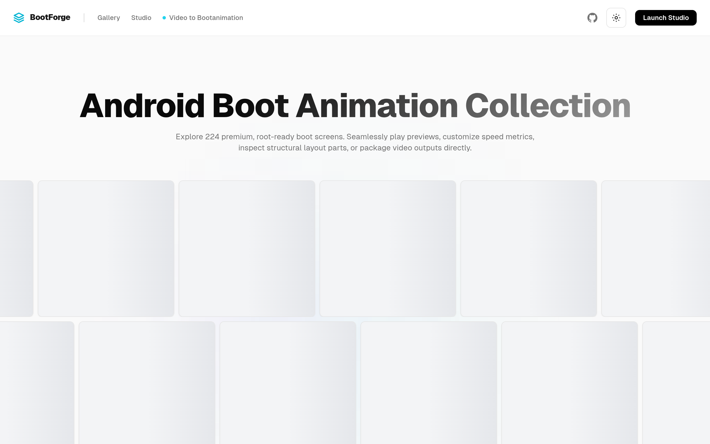

# 🛸 BootForge - The Custom Android Boot Collection 

> The ultimate workspace & asset directory for Android system boot animations.

<div align="center">
  
</div>

BootForge is a premium, open-source Next.js application designed for Android theme developers and custom ROM enthusiasts. It allows you to browse 220+ boot screen presets, customize loop dynamics, simulate playback frame-by-frame, and convert MP4/WebM videos directly into flashable, root-ready installer ZIPs client-side.

---

## ✨ Features

- **220+ Preset Gallery**: A curated directory of high-performance animations with instant visual hover previews.
- **Dynamic Playback Simulator**: Frame-by-frame Canvas simulator with speed configuration, scrubber control, and loop settings.
- **Video to Boot Animation**: Convert arbitrary video formats to Android boot animation ZIPs containing `desc.txt` configuration entirely client-side.
- **WASM Compiler**: Create Android installer ZIPs dynamically without any remote server rendering.
- **PWA Capabilities**: Fully installable as a progressive web app with progressive offline capabilities.

### 🎬 Featured Boot Animation Showcase

Here is a look at 9 of the best and most popular boot animation presets featured in the BootForge gallery (arranged in a symmetrical 3x3 collage):

| | | |
| :---: | :---: | :---: |
| <br>**Asus ROG 3D** | <br>**Zelda** | <br>**Watch Dogs** |
| <br>**Iron Man HUD** | <br>**Darth Vader** | <br>**Cortana (Halo)** |
| <br>**Cyber Cube** | <br>**Google Pixel Rainbow** | <br>**Alienware** |

---

## 🛠 Tech Stack & Architecture

- **Core Framework**: [Next.js 14](https://nextjs.org) (App Router)
- **Styling**: Tailwind CSS & Vanilla CSS Transitions
- **Client-Side Compression**: [JSZip](https://stuk.github.io/jszip/)
- **CDN Storage**: [Cloudflare R2 Object Storage](https://www.cloudflare.com/developer-platform/r2/)
- **PWA Service Worker**: [next-pwa](https://github.com/shadowwalker/next-pwa) (Workbox caching layers)
- **Deployment**: [Vercel](https://vercel.com)

---

## ⚡ Multi-Layer Caching System

To achieve blazing-fast speeds globally, BootForge implements a 4-tier caching architecture:

1. **Vercel Edge Network Cache**: pre-rendered HTML static pages served from the nearest edge node.
2. **Cloudflare CDN Cache**: R2 assets (GIFs, PNGs, ZIPs) served with `public, max-age=31536000, immutable` headers.
3. **PWA Service Worker Cache**: Active caching policies (`CacheFirst` for static R2 assets, `StaleWhileRevalidate` for pages & API endpoints) for offline playback.
4. **Browser Cache**: Pre-compiled Next.js chunks cached at the user browser.

---

## 🚀 Getting Started

### 1. Clone the Code

```bash
git clone https://github.com/Mr-Hasan-Hamid/bootforge.git
cd bootforge
```

### 2. Configure Environment Variables

Create a `.env.local` file in the root of the project:

```env
# Your Cloudflare R2 bucket public endpoint
NEXT_PUBLIC_R2_BASE_URL=https://pub-yourbucketid.r2.dev
```

### 3. Install Dependencies & Dev

```bash
npm install
npm run dev
```

Open [http://localhost:3000](http://localhost:3000) to see the application.

---

## 📦 Cloudflare R2 Asset Sync Pipeline

Large binary assets (previews, extracted frames, flashable ZIPs) are hosted on Cloudflare R2 to bypass deployment bundle limits and reduce hosting costs.

To sync assets:

1. Create a bucket named `bootforge-assets` in Cloudflare R2.
2. Enable the **Public Development URL** in bucket settings.
3. Generate an API Token with **Object Read & Write** permissions.
4. Download the standalone `rclone` binary or install it globally.
5. Put credentials in `~/.config/rclone/rclone.conf`:
   ```ini
   [r2]
   type = s3
   provider = Cloudflare
   access_key_id = <YOUR_ACCESS_KEY_ID>
   secret_access_key = <YOUR_SECRET_ACCESS_KEY>
   endpoint = https://<YOUR_ACCOUNT_ID>.r2.cloudflarestorage.com
   ```
6. Run the upload pipeline:
   ```bash
   bash scripts/upload-to-r2.sh https://pub-yourbucketid.r2.dev
   ```

The script will automatically compile folder manifests, upload all assets, and rewrite `animations.json` references to use your R2 CDN.

---

## 📄 License

Distributed under the MIT License. See [LICENSE](LICENSE) for details.
